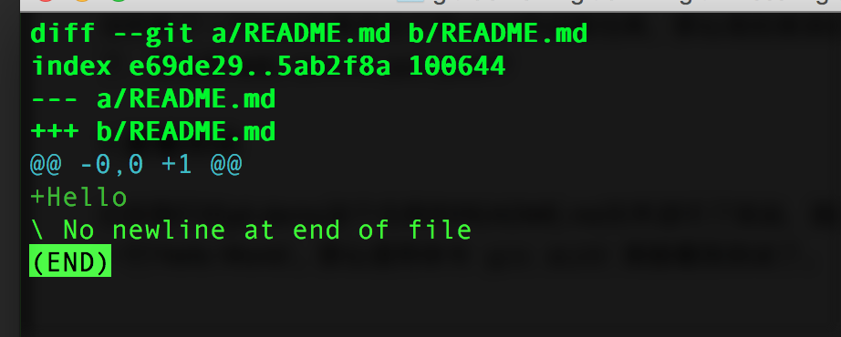

怎么把我的改动提交到远程仓库？
---
当你有了一个local仓库并且它有origin的远程仓库，那么现在就该发愁了，怎么玩 add, commit, pull, push?

####1.查看改动
比如我们对git-demo这个仓库的README.md文件进行了改动，添加了一行‘Hello World’。那么使用命令`git diff`就能看到改动了。 这里表示我在b版本的REAME.md中添加了一行。
进入这种状态时，按一下Q键就能退出预览了。不过我还是推荐用SourceTree来看diff,那样更直观，更好看。  

####2.添加和丢弃改动  
把改动添加到commit队列很容易，只需要使用`git add <filename>` 就可以了。如果嫌一个一个添加太麻烦，使用 `git add *`可以添加所有的改动。  
如果不小心添加错了，要丢弃这个添加,使用`git reset HEAD <filename>`来把这个改动的文件从commit队列里面移出来。  
如果这个文件的一些改动不想要，想恢复到上次commit时候的状态，那么使用命令 `git checkout -- <filename>`这个命令。  

####3.提交改动  
把你的改动添加到commit队列后，你就可以使用 `git commit -m 'message'`来做commit提交了，如果你觉得麻烦想一次commit所有改动就使用 `git commit -a`命令，它会让你进入vim编辑器编辑此次提交的信息。使用i键开始输入，按esc停止输入，然后shift + q进入保存模式，键入wq保存退出vim编辑器即可commit完成。  

####4.把改动推送到远端仓库  
