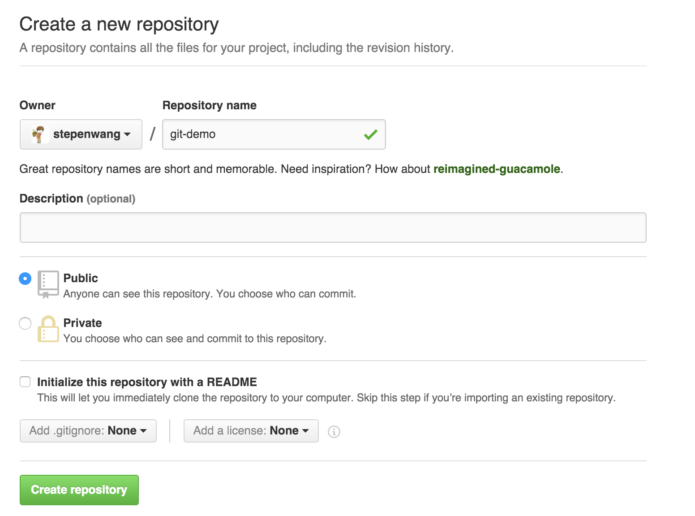
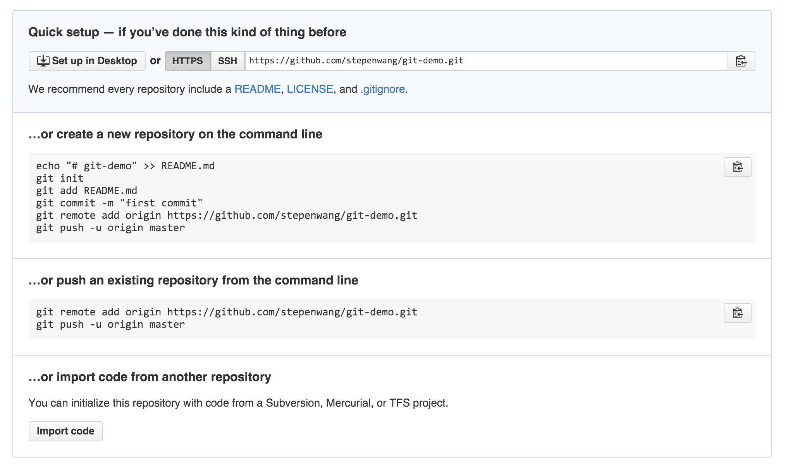
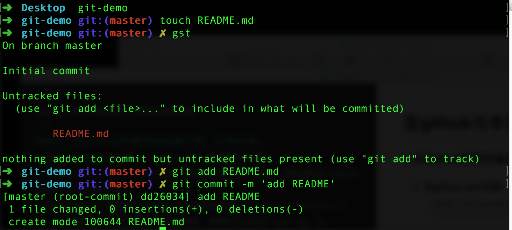
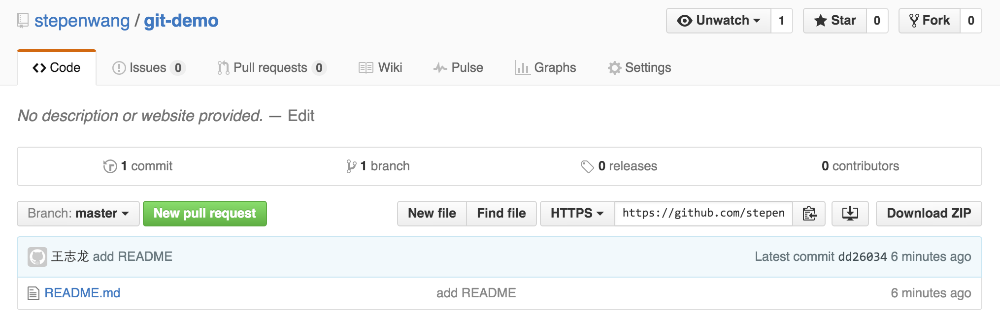
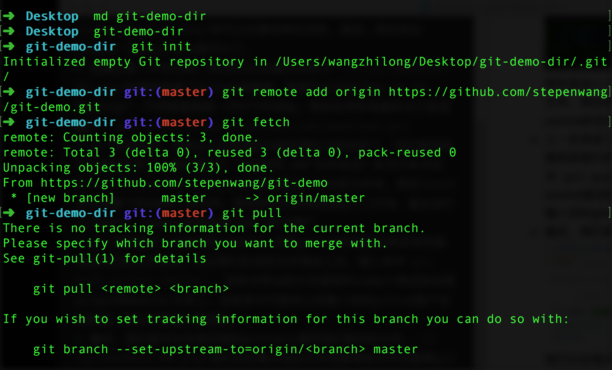

在github与本地同步仓库的各种姿势
---
####1.在Github的网页端创建仓库，拉到本地。
`命令行工具 oh-my-zsh`    

* 在github.com创建一个repo，键入你想要的名称：你可以任意地修改名称、描述。然后单击Create repository就可以了。
* 创建后是一个空仓库，所以Github提示你如下：如果你安装了Github桌面版，那就可以点击“Set up In Desktop”，不然就复制那一行HTTPS地址，然后在你的电脑命令行里面输入：`git clone https://github.com/xxxx/xxx.git`
* 上一步完成后，你的git仓库就应当被创建在当前目录下，这时候你就可以添加文件了。我们添加个 "README.md"文件试试？命令行命令如下：首先是进入了仓库文件夹，然后touch命令创建了README.md文件，然后把该文件添加进git工作流，最后进行了commit，commit的信息是“add README”
* 上一步完成了一次基本的commit，但是github的远程仓库还没有接收到我们的文件推送，所以我们应该把文件推送上去。键入命令`git push origin master`  该命令将当前分支超前的commit推送到远程origin的master分支上。这条命令可能会让你输入你的github账户名和密码，所以不要输入错误哦。
* 最后，我们就可以在网页版的github上看到我们推送的文件。我们以后每次添加文件或者修改文件后都要git add 来添加改动，然后commit提交改动，最后push到远程仓库同步。这样即使我们换了一台电脑也不用担心代码丢失了。  

####2.本地仓库添加远程地址
* 在本地新建一个文件夹，然后初始化为仓库，添加远程地址，同步，然后添加和提交改动。命令如下：这一系列结束后你会发现本地的目录里面有了远程仓库的文件。
* `md` 命令详解: md 在zsh下代表linux命令 mkdir ， 表示在当前目录下创建一个新目录。
* `git init` 把当前目录初始化为一个新的git 仓库
* `git remote add` 添加git 远程仓库的地址，这里输入了两个参数，origin 和一个https url。表示把git的origin url设置为指定的https url。为什么叫origin呢？ 这个我们将在多人协作中来解释。
* `git fetch` 获取远程分支的信息，因为你的当前master 分支会追踪远程的master分支的更新，所以你要fetch来手动获取。有更新所以我们会看到 *[new branch]这么个玩意。
* `git pull` 因为远程分支有更新，所以我们要把它拉下来，就用这个命令。命令完成后会发现目录里面文件就会得到了更改。那么以后你就可以继续添加改动，提交改动并且同步了。